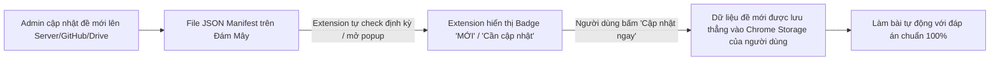

# 🌐 HƯỚNG DẪN CẤU HÌNH CẬP NHẬT ĐỀ THI ONLINE (OTA UPDATES)

Hệ thống cho phép bạn **cập nhật câu hỏi và đáp án cho một cuộc thi mới từ xa**. Toàn bộ người dùng đã cài đặt extension sẽ tự động nhận được thông báo có gói đề mới và chỉ cần bấm **"Cập nhật ngay"** trực tiếp trên extension để tải dữ liệu về!

---

## 🛠️ 1. Cơ chế hoạt động của tính năng Update Online



---

## 🚀 2. Cách để bạn (Admin) tải lên và cập nhật đề mới

### Cách 1: Sử dụng GitHub Repository (Miễn phí 100% & Khuyên dùng)

1. Tạo một GitHub Repository miễn phí (ví dụ: `https://github.com/your-username/autothi-data`).
2. Tải file [`contests_manifest.json`](file:///d:/Tool/AutoThi/server_data_sample/contests_manifest.json) lên repo này.
3. Lấy link **Raw** của file (ví dụ: `https://raw.githubusercontent.com/your-username/autothi-data/main/contests_manifest.json`).
4. Khi có cuộc thi mới (ví dụ: *Cuộc thi Tìm hiểu Lịch sử Đảng 2026*, *Cuộc thi An toàn giao thông 2026*), bạn chỉ cần mở file trên GitHub, thêm nội dung câu hỏi & tăng số `version` lên:
   ```json
   {
     "id": "an_toan_giao_thong_2026",
     "name": "Cuộc thi Tìm hiểu An toàn Giao thông 2026",
     "organizer": "Ban An toàn Giao thông",
     "version": 1,
     "total_questions": 50,
     "updated_at": "18/08/2026",
     "questions": {
       "người điều khiển xe mô tô phải đội mũ bảo hiểm khi nào?": {
         "question": "Người điều khiển xe mô tô phải đội mũ bảo hiểm khi nào?",
         "correctAnswer": "Khi tham gia giao thông trên mọi tuyến đường",
         "options": ["Khi tham gia giao thông trên mọi tuyến đường", "Chỉ khi đi trên quốc lộ", "Chỉ khi trời mưa"]
       }
     }
   }
   ```
5. Commit thay đổi. **Ngay lập tức**, tất cả người dùng extension sẽ thấy cuộc thi này xuất hiện trong mục **"🌐 Đề Online"** với nút **"Cập nhật ngay"**!

---

### Cách 2: Sử dụng Google Sheets / Google Drive (Dễ chỉnh sửa cho người không rành code)

Bạn có thể tạo một Google Sheet chứa danh sách câu hỏi & đáp án, sau đó xuất ra link JSON thông qua Google Apps Script Web App để làm server cập nhật.

---

### Cách 3: Sử dụng Máy chủ / VPS riêng (Node.js / PHP / Python API)
Tạo API endpoint GET trả về đúng định dạng JSON như trong file mẫu [`server_data_sample/contests_manifest.json`](file:///d:/Tool/AutoThi/server_data_sample/contests_manifest.json).

---

## 📱 3. Trải nghiệm phía Người Dùng (End-User)

1. Khi bạn tung ra cuộc thi mới, trên extension của người dùng:
   - Biểu tượng Extension sẽ có chấm đỏ / badge báo **`1 MỚI`** hoặc **`2 MỚI`**.
   - Tab **"🌐 Đề Online"** sáng đèn thông báo.
   - Thẻ cuộc thi mới có viền cam nổi bật và nút **"📥 Cập nhật ngay"**.
2. Người dùng chỉ việc bấm **"Cập nhật ngay"** $\rightarrow$ Hệ thống tự tải toàn bộ ngân hàng câu hỏi vào máy $\rightarrow$ Trạng thái chuyển thành **`✓ Đã cài v1.0`**.
3. Khi người dùng vào trang thi, Extension sẽ ưu tiên lấy đáp án chuẩn 100% từ gói đề vừa tải về để làm bài tự động!
